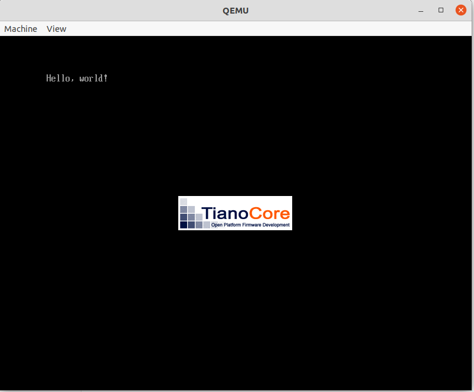

# ゼロからのOS自作入門　作業記録

内田公太氏の「ゼロからのOS自作入門」でのOS作成作業を記録として記す。

## 2/28
開発環境の構築

自作OSの開発に利用した環境
- ThinkCentre M720s Small
- Ubuntu 20.04 Focal Fossa

動作確認は、仮想マシンのqemuを使用する。
BOOTX64.EFIというファイルにバイナリを打ち込んで、起動する。gitに完成済みのEFIファイルがあるが、初めての作業なのでoctetaで一つずつ１６進数を打ち込むことにした。
qemuで「Hello, workd」を表示できた。

## 3/1
