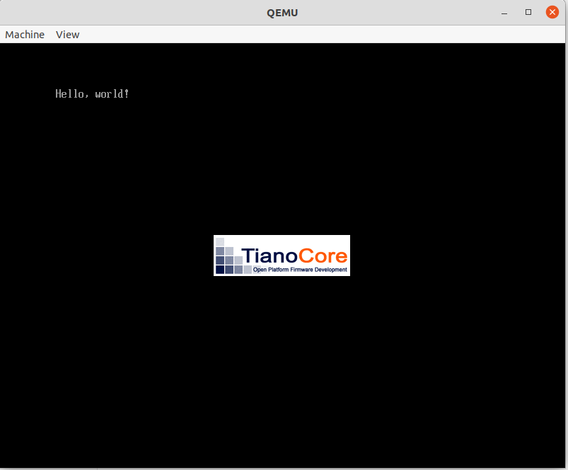
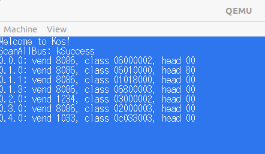

## 2/28
開発環境の構築

自作OSの開発に利用した環境
- ThinkCentre M720s Small
- Ubuntu 20.04 Focal Fossa

動作確認は、仮想マシンのqemuを使用する。
BOOTX64.EFIというファイルにバイナリを打ち込んで、起動する。gitに完成済みのEFIファイルがあるが、初めての作業なのでoctetaで一つずつ１６進数を打ち込むことにした。
qemuで「Hello, workd」を表示できた。



C言語で同じ動作をするEFIファイルを作成する。
Cプログラム→（コンパイラ clang）→オブジェクトファイル→ (リンカ lld-link) → EFIファイル(hello.efi)

## 3/1
EDKⅡを利用してアプリケーション開発ができるようにする。
まずはEDKでのハローワールドから始める。

EDKⅡ：UEFI BIOS上で動作するアプリケーション開発キット

２章を読んだのみで実装は進まなかった。

## 3/4

EDKでハローワールド
KosLoaderPkg/以下にLoad.inf, Main.c, KosLoaderPkg.dec, KosLoaderPkg.decの４ファイルを作成し、EDKを用いてビルドを行う
→Loader.efiが生成されるため、これをBOOTX64.EFIとして保存する。(run_qemu.shで実行できる)

実行結果：edkでハローワールド(めっちゃ誤字している)


今後このアプリケーションをブートローダとして拡張していく

まずはメモリマップの取得を行う。

edkで用意されている機能`gBS->GetMemoryMap`を使用する。
```c
EFI_STATUS GetMemoryMap(
    IN OUT UINTN *MemoryMapSize,
    IN OUT EFI_MEMORY_DSCRIPTOR *Memorymap,
    OUT UINTN *MapKey,
    OUT UINTN *DescriptorSize,
    OUT UINT32 *DescriptorVersion
);
```
- MemoryMapSize：MemoryMapのバッファサイズ（出力は実際のメモリサイズ）
- MemoryMap: メモリマップ書き込み先のメモリ領域の先頭ポインタ
- MapKey：メモリマップを識別するための値を書き込む変数を指定する
- DescriptorSize: メモリマップの個々の行を表すメモリディスクリプタのバイト数
- DescriptorVersion: メモリディスクリプタ構造体のバージョン番号（使用しない）


メモリマップの読み込み成功。下図はメモリディスクリプタの各要素csvファイルとして出力している。[memorymap](./memorymap)
```
Index, Type, Type(name), PhysicalStart, NumberOfPages, Attribute
0, 3, EfiBootServicesCode, 00000000, 1, F
1, 7, EfiConventionalMemory, 00001000, 9F, F
2, 7, EfiConventionalMemory, 00100000, 700, F
3, A, EfiACPIMemoryNVS, 00800000, 8, F
4, 7, EfiConventionalMemory, 00808000, 8, F
5, A, EfiACPIMemoryNVS, 00810000, F0, F
6, 4, EfiBootServicesData, 00900000, B00, F
7, 7, EfiConventionalMemory, 01400000, 3AB36, F
...
```

第二章おわり！

## 3/5
第３章レジスタ

QEMUモニタの使い方(GDBと同じか？) [wikibooks](https://en.wikibooks.org/wiki/QEMU/Monitor)
- info registers
- x/2i 0x067ae4c4


- 初めてのkernel作成
- ブートローダとkernelは別ファイルとして開発する
- カーネルのコンパイル時にエラーが出た
```bash
# kernel/main.cpp のコンパイル
~/kos/kernel$ clang++ -O2 -Wall --target=X86_64-elf -ffreestanding -mno-red-zone -fno-exceptions -fno-rtti -std=c++17 -c main.cpp
clang: warning: argument unused during compilation: '-mno-red-zone' [-Wunused-command-line-argument]
error: unknown target triple 'X86_64---elf', please use -triple or -arch
```

- `--target`フラグなしでコンパイルを実行して解決
- コンパイラがmain.oを生成する
- 次にリンカを実行して、main.oから実行可能ファイル(elf)を作成する
```bash
~/kos/kernel$ ld.lld --entry KernelMain -z norelro --image-base 0x100000 --static -o kernel.elf main.o
```

```
main.cpp -> (clang++でコンパイル) -> main.o -> (ld.lldでリンク) -> kernel.elf
```

- 次に、ブートローダを拡張してカーネルファイルを読み込む機能を追加する
- 謎のオフセット24バイト（下記コード）
- → ELFの仕様で、64bit用のEFLのエントリポイントアドレスは、オフセット24バイトの位置から8バイト整数で書かれている。
```c
   // Boot kernel
    UINT64 entry_addr = *(UINT64*)(kernel_base_addr + 24);

    typedef void EntryPointType(void);
    EntryPointType* entry_point = (EntryPointType*)entry_addr;
    entry_point();
```

- kernelのロード＋起動成功


- 画面の色をいじっていく
- まずはブートローダでピクセルを描く(UEFIのGOP機能)
- openProtocol関数でgopを取得する
```c
gBS->OpenProtocol(
        gop_handles[0],
        &gEfiGraphicsOutputProtocolGuid,
        (VOID**)gop,
        image_handle,
        NULL,
        EFI_OPEN_PROTOCOL_BY_HANDLE_PROTOCOL
    );
```

UEFIでピクセル色指定をした結果


- 次にカーネルでピクセルを描く+エラー処理
- gBSの各関数の戻り値(EFI_STATUS型)をチェックしてエラーの場合には、メッセージ表示＋hltを行う。


## 3/8

第４章 make入門

- kernelのコード (main.cpp) にピクセルを描画する処理を追加する。
- なぜか黄色が表示される。。。


- 原因はフレームバッファにred要素を書いていなかったことだった。`p[2] = c.r`の記述がない。
```c
// main.cpp WritePixel関数内
} else if (config.pixel_format == kPixelBGRResv8BitPerColor) {
    uint8_t* p = &config.frame_buffer[4 * pixel_position];
    p[0] = c.b;
    p[1] = c.g;
} else {
```
- これでピクセルの描画を楽に記述できるようになった。


- ローダの改良
  - カーネルの読み込み処理で、メモリ上に確保するメモリサイズを計算する処理が間違っている。
  - kernel.elfの情報 (ELFプログラムヘッダのLOAD部分) を見て、正しいサイズのメモリを確保するように修正する。

- 書き換えたがなぜか以下のエラーが出てkernelが実行されない。
```
failed to allocate pages: Not Found
```

= 取得しようとしているページ数が大きすぎた
- num_pagesの計算で`0xfff`を乗算しているのがミス
```c
UINTN num_pages = (kernel_last_addr - kernel_first_addr * 0xfff) / 0x1000;
    status = gBS->AllocatePages(
        AllocateAddress,
        EfiLoaderData,
        num_pages,
        &kernel_first_addr
    );
```

## 3/9
第５章　文字表示とコンソールクラス

- ピクセルの描画はできるようになっているので、それを用いて文字を描画する


- 参照とポインタの使い分け
  - ポインタ：C言語からある機能。`nullptr`とか書くだけで簡単にNULLポインタを作成できる。
  - 参照：C++で追加された機能。NULL参照が作りにくい。引数で参照を指定することでNULLではないものを渡してほしいという意思表示として使える。

- フォントのファイルをカーネルファイルに組み込む
- ELFなどではないバイナリも、実行可能ファイルにリンクしてプログラムから変数として見えるようにすることができる。これは知らなかったためかなり勉強になった。
```bash
// hankaku.bin(フラットバイナリ)→hankaku.o(ELFオブジェクトファイル)
$ objcopy -I binary -O elf64-x86-64 -B i386:x86-64 hankaku.bin hankaku.o
$ file hankaku.o 
hankaku.o: ELF 64-bit LSB relocatable, x86-64, version 1 (SYSV), not stripped
```
- ASCII文字列を一通り利用できるようになった。


- 文字の折返し、スクロールなどを行うconsoleクラスの実装　完了


## 3/11

第6章 マウス入力とPCIe

- UIのアップデート。背景に色をつけ、画面下にタスクバーを模した長方形を描画することでそれらしい見た目になった。
- ホストマシン (ubuntu) を再起動すると、環境変数がリセットされたことでkernelをビルドするためのmakeコマンドが失敗した。
- 起動時に環境変数が自動で設定されるように、$HOME/.bashrcに下記を追記する
```bash
# .bashrc
source $HOME/osbook/devenv/buildenv.sh
```

- USBホストドライバを実装する
- USB (Universal Serial Bus)　←地味に知らなかった
- ドライバの実装がどんなのものなのか知らなかったので、何よりもこの章が楽しみだった。
- →ドライバの実装には解説はないらしい。残念。


- PCIデバイスの読み取り
- IOアドレス空間：メモリアドレス空間とは別のアドレス空間。周辺機器用のアドレス空間。
- PCIコンフィグレーション空間（周辺機器にある）にアクセスするためにIOアドレス空間を利用する。

- ScanAllBus関数では、PCIデバイスをすべて探索している
- bus=0, device=0, function=0から検索する
  - device: 1つのバスに最大32個まで
  - function: 1つのデバイスに最大8個まで
- なぜfunctionで探索している？

- PCIファンクションがPCI-to-PCIブリッジ（２つのPCIバスをつなぐブリッジ）である場合、ブリッジの下流側のバスに対して、PCIデバイスを探索する。
- PCI-to-PCIブリッジは、PCIデバイスの最大接続数を増やすために利用される。
```cpp
Error ScanAllBus() {
    ...

    for (uint8_t function = 1; function < 8; ++function) {
        if (ReadVendorId(0, 0, function) == 0xffffu) {
            continue;
        }
        // ScanBusの引数はbus番号のはずだが、function番号として1-8を引数に入れている。なぜ？
        if (auto err = ScanBus(function)) {
            return err;
        }
    }
    return Error::kSuccess;
}
```


- PCIデバイスの探索+表示に成功



- ポーリングでマウス入力を読み取る


- 6.4節のコードをビルドする際にエラーが発生した。
- エラーの要点と思われる箇所はこちら：`ld.lld: error: cundefined symbol: _exit`
- 
```bash
$ make
ld.lld -L/home/user/osbook/devenv/x86_64-elf/lib --entry KernelMain -z norelro --image-base 0x100000 --static -o kernel.elf main.o graphics.o mouse.o font.o hankaku.o newlib_support.o console.o pci.o asmfunc.o libcxx_support.o logger.o usb/memory.o usb/device.o usb/xhci/ring.o usb/xhci/trb.o usb/xhci/xhci.o usb/xhci/port.o usb/xhci/device.o usb/xhci/devmgr.o usb/xhci/registers.o usb/classdriver/base.o usb/classdriver/hid.o usb/classdriver/keyboard.o usb/classdriver/mouse.o -lc -lc++
ld.lld: error: cundefined symbol: _exit
>>> referenced by abort.c
>>>               lib_a-abort.o:(abort) in archive /home/user/osbook/devenv/x86_64-elf/lib/libc.a

ld.lld: error: undefined symbol: kill
>>> referenced by signalr.c
>>>               lib_a-signalr.o:(_kill_r) in archive /home/user/osbook/devenv/x86_64-elf/lib/libc.a

ld.lld: error: undefined symbol: getpid
>>> referenced by signalr.c
>>>               lib_a-signalr.o:(_getpid_r) in archive /home/user/osbook/devenv/x86_64-elf/lib/libc.a
make: *** [Makefile:25: kernel.elf] Error 1
```

- newlib_support.cにライブラリ関数を追加するのを忘れていた。みかん本に挑戦している別の方の[ページ](https://zenn.dev/link/comments/74146f544f98f3)の記述から気づくことができた。

- カーソルを動かすことに成功した。デバッグにかなり長い時間(4時間ほど)かかってしまった。。


## 3/18
第7章 割り込みハンドラ

- 特殊なアドレス空間
  - アドレス空間の中には、メインメモリに配置されている領域だけではなく、CPUレジスタに領域が配置されている範囲もある。
  - 0xfee00000から0xfee00400までのアドレス (1024バイト) は、メインメモリではなくCPUのレジスタに配置されている。　
  - 特に0xfee000b0番地への書き込みを行うことで、割り込み処理の終了をCPUに伝えることができる。
- C++の記法
  - `__attribute__((interrupt))`修飾子：割り込みハンドラであることを伝える。これがついている関数には、コンパイル時にコンテキストの保存と復帰処理が挿入される。
  - `__attribute__((packed))`修飾子：コンパイラは本来自動で変数のアラインメントを行うが、これがついている変数に対しては、変数のアラインメントを行わない。
  - `reinterpret_cast<型>`：ポインタ型もしくは整数型(int, longなど)を、任意の型のポインタに変換する。[参考](https://www.yunabe.jp/docs/cpp_casts.html)あくまでコンパイラに型情報を伝えるためなので、生成されるコードは普通変わらない。


```cpp
union InterruptDescriptorAttribute {
  // このdata変数は、bits変数のサイズ(16bit)をコンパイラに伝えるためだけに宣言している
  // 実際には使用しない
  uint16_t data;  
  struct {
    uint16_t interrupt_stack_table : 3;
    uint16_t : 5;
    DescriptorType type : 4;
    uint16_t : 1;
    uint16_t descriptor_privilege_level : 2;
    uint16_t present : 1;
  } __attribute__((packed)) bits;  // 16bitのメモリ領域を[3bit, 5bit, 4bit, 1bit, 2bit, 1bit]に分けてアクセスすることができる
} __attribute__((packed));  // アラインメントを行わない
```

## 3/23 第7章

第7章続き

- 割り込みハンドラの高速化
  - 割り込みハンドラ内でピクセルの描画まで実行する→遅い
  - 割り込みハンドラ内では、割り込みが起こったことのイベントのみを保存し、ピクセルの描画はあとで実行する→処理が速くなる
- queueを使ってイベントを保存する。
- queueの操作中に割り込みが起こると、データ競合が発生するため、cli(Clear Interrupt Flag)命令で割り込みを受け取らないようにする。
- cliの注意点：データ競合から保護すべき処理が終わったら、sti (Set Interrupt Flat)命令を用いて、割り込みの受付を復活させる。これを行わないと、例えばXHCからの入力がすべて無視されることでカーソルポインタが動かなくなったりする。


第8章　メモリ管理

- メモリマップの表示ができない問題を調査
- 下記のコードはメモリマップを表示している部分。
  - 1個目のfor文でMemoryDescriptorの配列を表示
  - 2個目のfor文で特定のメモリタイプのもののみを表示する(available_memory_types)
```cpp
    const std::array available_memory_types{
      MemoryType::kEfiBootServicesCode,
      MemoryType::kEfiBootServicesData,
      MemoryType::kEfiConventionalMemory,
    };

    printk("memoru_map: %p\n", &memory_map);

    printk("memory_map.buffer: %p\n", memory_map.buffer);
    printk("memory_map.map_size: %d\n", memory_map.map_size);
    printk("memory_map.descriptor_size: %d\n", memory_map.descriptor_size);
    for (uintptr_t iter = reinterpret_cast<uintptr_t>(memory_map.buffer);
         iter < reinterpret_cast<uintptr_t>(memory_map.buffer) + memory_map.map_size;
         iter += memory_map.descriptor_size) {
      auto desc = reinterpret_cast<MemoryDescriptor*>(iter);
      for (int i=0; i < available_memory_types.size(); ++i) {
        if (desc->type == available_memory_types[i]) {
          printk("type = %u, phys = %08lx - %08lx, pages = %lu, attr = %08lx\n",
              desc->type,
              desc->physical_start,
              desc->physical_start + desc->number_of_pages * 4096 - 1,
              desc->number_of_pages,
              desc->attribute);
        }
      }
    }
```
- printkでmemory_map構造体の要素を表示した結果が以下のようになった。

- `memory_map.descriptor_size`が異常に大きいことがわかる。
- → memory_map変数が正しくセットされていないことが考えられる。
- 解決：memory_mapはブートローダからKernelMainに渡される際に、引数を経由させているが、ブートローダ側のコード(Main.cpp)で引数を設定していなかった。


- メモリ割当要求に対応できるようにする。つまり、空きメモリ領域の管理が必要になるので実装していく。
- 上記を行うために、３つのデータ構造をOS管理のメモリ領域に移動させる。（これまではUEFI管理のメモリ領域にあった）
  - スタック領域
  - GDT (Global Descriptor Table)
  - ページテーブル


第9章　重ね合わせ処理

- layer.hpp, window.hppを追加
- ウィンドウ描画に，レイヤー機能を追加する章
- day09aのコードを書き終えたと思った時点で，再起動ループするバグが出た．


- 上記のバグは，window.hpp内のタイプミスが原因だった．
  - main.cppの中で，`DrawDesktop(*bgwriter)`が実行される．この時に，`bgwriter`オブジェクトのWidthとHeightを使って，`FillRectangle`が実行される．

```cpp
// window.hpp

    // window_.Width()ではなく，window_.Height()が整形
    virtual int Height() const override { return window_.Width(); }
```

```cpp
// graphics.cpp
void FillRectangle(PixelWriter& writer, const Vector2D<int>& pos, const Vector2D<int>& size, const PixelColor& c) {
  for (int dy = 0; dy < size.y; ++dy) {
    for ( int dx = 0; dx < size.x; ++dx) {
      writer.Write(pos.x + dx, pos.y + dy, c);
    }
  }
}
```

- day09b: マウスの描画が遅いのでタイマーを追加して計測する．
- マウスを動かすと，1回の更新にかかった時間が表示される．


- day09c: マウス描画の高速化１・フレームバッファの追加
- カーソルの描画が消えない問題が発生したので，デバッグを行う．
  - `FrameBuffer::Copy`の実装にミスがあるという当たりをつけて，ミスを探したが，見つけることができなかった．
  - 最終的に，配布されている正しいソースコードとのdiffを確認して，以下のコードに間違いがあることを発見した．


```cpp
// frame_buffer.cpp FrameBuffer::Copy
uint8_t* dst_buf = config_.frame_buffer + bytes_per_pixel *
    (config_.pixels_per_scan_line * copy_start_dst_y + copy_start_dst_x);
// uint8_t* src_buf = config_.frame_buffer; // 誤
uint8_t* src_buf = src.config_.frame_buffer; // 正
```

修正後の様子


- day10b: ウィンドウを表示するようにソースコードの修正を行った後の動作確認で，描画にバグが発生した．
  - 1. 新たに追加したウィンドウが複数個表示される．
  - 2. ウィンドウの下側(y軸+側)の表示が乱れている．


- GDBを用いたデバッグ方法
- gdb ./kernel.elf
- (gdb) target remote localhost:12345


- frame_bufferのコピー処理に実装ミスがあった．
```cpp
// frame_buffer.cpp
// FrameBuffer::Copy
  const Vector2D<int> dst_start = ElementMax(dst_pos, {0, 0});
  // const Vector2D<int> dst_end = ElementMax(dst_pos + src_size, dst_size);  // 誤
  const Vector2D<int> dst_end = ElementMin(dst_pos + src_size, dst_size);     // 正
```


- day10c: メイン関数のループ回数をカウントして表示するウィンドウを作成．
- ループ内のhlt命令を消したため，マウス移動などしなくても爆速でカウントが増加する．
- hlt命令アリの場合，マウスを動かした時にのみカウントが増加する．


- day10d: ウィンドウのチラチラ解消


- day10f: ウィンドウを動かす


- day11e
  - gdbサーバの起動はqemu-run.shで指定されている$QEMU_OPTSから設定できる．
  - QEMU実行前に以下のコマンドを実行してオプションを指定し，gdbでアタッチ，もしくはvscodeのデバッグ機能でアタッチすると，デバッグ作業ができる．
```bash
export QEMU_OPTS="-gdb tcp::12345 -S"
```

## 2025/03/16
- day15a
  - TaskB のウィンドウをマウスで動かすと、ウィンドウの描画が一部だけゴミのように残ってしまう問題を修正する節
  - TaskB ウィンドウの描画処理 (Draw メソッド)と マウスで TaskB のウィンドウを移動させる描画処理 (MoveRelative) がデータ競合を起こす。どちらもスクリーンのバックバッファ、フレームバッファを書き換えているのでこれが起こるらしい。。
  - あー、なるほど、それぞれの描画処理は別のコンテキストで実行されているのか。メインタスクと TaskB のコンテキストでそれぞれ描画が行われている
  - 回避方法: ウィンドウの描画や移動の処理を、すべて 1 つの専用タスクで実行させる。これで競合はなくなる。
    - 専用タスク == メインタスク

- TaskB 関数の中で cli してるが、メッセージ受信できた際に sti してないように見える。これでいいのかな？
→ まあよしとして先に進もう。
```cpp
// void TaskB(uint64_t task_id, int64_t data)
 while (true) {
  __asm__("cli");
  auto msg = task.ReceiveMessage();
  if (!msg) {
    task.Sleep();
    __asm__("sti");
    continue;
  }

  if (msg->type == Message::kLayerFinish) {
    break;
  }
}
```